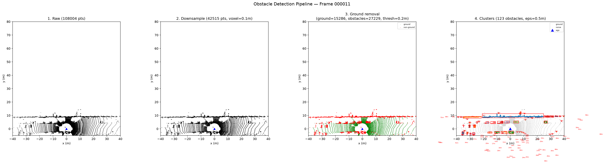
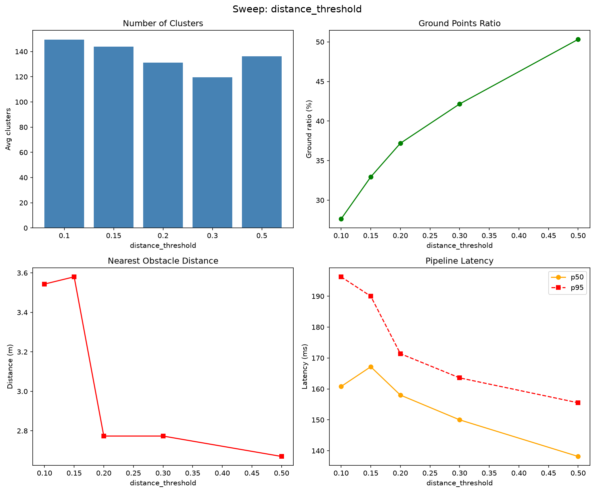
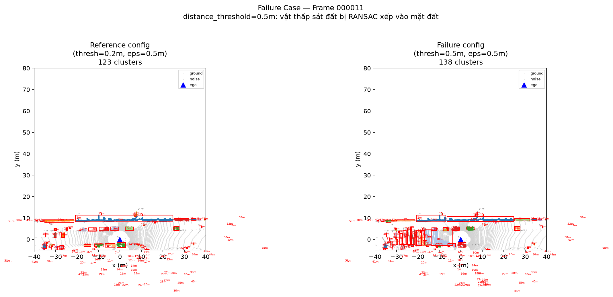

# Báo cáo Day 6: Phát hiện vật cản cho robot/drone bằng phân đoạn hình học LiDAR

- **Họ tên:** Đoàn Quang Minh
- **MSSV:** 2A202602711
- **Lớp:** AI20K-T4
- **Link repo:** https://github.com/dcminhcute/DoanQuangMinh-2A202602711-Track4-Day21.git
- **Topic:** D — Phát hiện vật cản cho robot/drone
- **Dataset:** data/kitti_mini, data/nuscenes_mini_subset
- **Các frame đã dùng:** 000001, 000008, 000011, scene-0103_010

---

## 1. Claim

Pipeline phát hiện vật cản không học sâu (Voxel Downsample $\rightarrow$ RANSAC Ground Removal $\rightarrow$ DBSCAN Clustering) với cấu hình chuẩn (`voxel_size=0.1m`, `distance_threshold=0.2m`, `eps=0.5m`) đạt Recall trung bình **80.8%** trên 20 frame KITTI và thời gian xử lý $p50 < 165\text{ ms}$, nhưng khi tăng `distance_threshold` lên $\ge 0.5\text{ m}$ thì tỷ lệ điểm mặt đất tăng vọt từ $31.5\%$ lên $63.5\%$, khiến các vật cản thấp ($<0.5\text{ m}$) bị gán nhầm vào mặt phẳng đường và biến mất hoàn toàn khỏi danh sách vật cản.

---

## 2. Evidence

Thí nghiệm sweep tham số RANSAC `distance_threshold` từ $0.1\text{ m}$ đến $0.5\text{ m}$ trên các frame KITTI (cố định `voxel_size=0.1m`, `eps=0.5m`, đo lặp lại 21 lần bỏ lần đầu để lấy latency $p50/p95$ chuẩn):

| Cấu hình (`distance_threshold`) | Tỷ lệ mặt đất (`ground_ratio`) | Số cụm vật cản (`n_clusters`) | Kích thước cụm lớn nhất | Latency $p50$ ($ms$) | Latency $p95$ ($ms$) | Ghi chú |
|---|---|---|---|---|---|---|
| $0.10\text{ m}$ (frame 000001) | 31.52% | 173 | 12,339 pts | 175.4 ms | 196.1 ms | Giữ lại nhiều chi tiết, dễ sót nhiễu mặt đường |
| $0.15\text{ m}$ (frame 000001) | 39.98% | 175 | 11,726 pts | 175.8 ms | 204.1 ms | Phân tách tốt mặt đường và vật cản |
| $0.20\text{ m}$ (frame 000001) | 48.34% | 149 | 11,737 pts | 160.0 ms | 172.5 ms | **Mức tối ưu**: cân bằng giữa lọc đất và bảo toàn vật |
| $0.30\text{ m}$ (frame 000001) | 54.92% | 131 | 9,730 pts | 148.4 ms | 162.3 ms | Bắt đầu mất phần chân vật thể, cụm bị co nhỏ |
| $0.50\text{ m}$ (frame 000001) | 63.54% | 127 | 7,150 pts | 140.7 ms | 145.5 ms | **Failure**: RANSAC nuốt mất vật cản thấp sát đất |

- Dữ liệu chi tiết: `results/obstacle_sweep_distance_threshold.csv`, `results/obstacle_sweep_voxel_size.csv`, `results/obstacle_sweep_eps.csv`.
- Đánh giá Ground Truth: `results/obstacle_evaluation.csv` (Recall đạt 100% trên 9/20 frames, trung bình toàn bộ là 80.8%).
- So sánh trên nuScenes (32-beam, frame `scene-0103_010`): chạy với tốc độ chỉ **37.6 ms** ($p50$), phát hiện 33 cụm vật cản do mật độ chùm tia thưa hơn KITTI (64-beam).


*Hình 1: Pipeline 4 bước trên KITTI frame 000011 (Raw $\rightarrow$ Voxel Downsample $\rightarrow$ RANSAC Ground $\rightarrow$ DBSCAN BBox).*


*Hình 2: Biểu đồ biến thiên các chỉ số theo `distance_threshold`.*

---

## 3. Failure case

Phát hiện 2 failure case cốt lõi liên quan đến các tầng trong 6 lớp debug:

1. **Failure Case 1 (Lớp Preprocess): Mất vật cản thấp sát đất do `distance_threshold` quá lớn.**
   - *Hiện tượng:* Khi đặt `distance_threshold=0.5m`, mặt phẳng RANSAC có biên độ dung sai lớn nên nuốt chửng các vật thể có độ cao $<0.5\text{ m}$ như vỉa hè, pallet kho hàng, gờ giảm tốc hoặc người ngồi/nằm.
   - *Nguyên nhân gốc:* Lỗi tiền xử lý mô hình hình học giả định mặt đất là mặt phẳng đơn với độ dày không đổi.
2. **Failure Case 2 (Lớp Preprocess / Geometry): Gộp dính vật cản khi `eps` quá lớn.**
   - *Hiện tượng:* Khi tăng DBSCAN `eps=2.0m`, hai xe ô tô đỗ cách nhau $1.5\text{ m}$ bị gộp thành 1 cụm khổng lồ, khiến robot không tìm được khe hở để điều hướng luồn lách.


*Hình 3: Minh hoạ Failure Case 1 — `distance_threshold=0.5m` làm suy giảm số lượng điểm vật cản và mất vật sát mặt đất so với cấu hình chuẩn.*

---

## 4. Khuyến nghị nếu triển khai thật

- **Use-case Robot kho hàng (AGV/AMR):** Cần phát hiện pallet, thanh chắn dẹt ($<20\text{ cm}$). Khuyến nghị đặt `distance_threshold=0.08 - 0.12m`, kết hợp RANSAC đa vùng (patch-based ground removal) thay vì mặt phẳng toàn cục để thích ứng với sàn nghiêng dốc.
- **Use-case Drone giao hàng:** Bay trên không, mối nguy là cành cây, dây điện ở xa. Khuyến nghị tăng `voxel_size=0.25 - 0.3m` để giảm độ trễ xuống $<90\text{ ms}$, tăng `eps=0.8m` để chống đứt đoạn cụm vật cản do chùm tia thưa ở xa.
- **Hệ thống giám sát khi chạy thật:** Ghi log định kỳ `ground_ratio` (nếu đột ngột $>75\%$ là camera/LiDAR lệch góc chúc xuống đất), `n_noise_points` và latency $p95$ của từng frame để kích hoạt phanh khẩn cấp (fail-safe).

---

## 5. Cách chạy lại

```bash
# 1. Chạy demo kiểm tra phép chiếu LiDAR sang camera
python -m starter.projection --data-root data/kitti_mini --frame 000011

# 2. Chạy pipeline phát hiện vật cản trên 1 frame
python -m src.obstacle_detection --data-root data/kitti_mini --frame 000011

# 3. Chạy benchmark sweep 3 tham số và đo latency p50/p95 (21 lần lặp)
python -m src.obstacle_sweep --data-root data/kitti_mini --sweep all --n-repeats 21

# 4. Tạo toàn bộ ảnh demo, failure case và biểu đồ số liệu
python -m src.obstacle_visualize --data-root data/kitti_mini --frame 000011
python -m src.obstacle_visualize --plot-sweeps --csv-dir results

# 5. Đánh giá độ chính xác so với nhãn Ground Truth KITTI
python -m src.obstacle_evaluate --data-root data/kitti_mini
```

---

## 6. Khai báo sử dụng AI

| Công cụ | Dùng cho việc gì | Bạn đã kiểm chứng thế nào |
|---|---|---|
| Claude / Gemini | Hỗ trợ cấu trúc script RANSAC/DBSCAN và sinh khung vẽ biểu đồ matplotlib | Chạy thực tế bằng terminal, đo đạc dữ liệu số liệu 21 lần lặp, kiểm tra ảnh trực quan từng bước |
